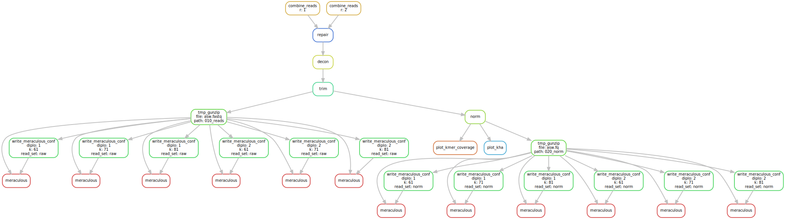

# `asw-nopcr`

Attempted short-read genome assembly for Argentine stem weevil, described in https://github.com/TomHarrop/asw-gbs-genome-paper.

## Citation

> Thomas W. R. Harrop, Marissa F. Le Lec, Ruy Jauregui, Shannon E. Taylor, Sarah N. Inwood, Tracey van Stijn, Hannah Henry, et al. 2020. “Genetic Diversity in Invasive Populations of Argentine Stem Weevil Associated with Adaptation to Biocontrol.” Insects 11 (7): 441. [10.3390/insects11070441](https://doi.org/10.3390/insects11070441).

## Requirements

All software run in containers, so the only requirements are:

- [`singularity`](https://singularity.lbl.gov) ≥ 3.5.3  
- [`snakemake`](https://snakemake.readthedocs.io) ≥ 5.9.1

## Reproduce the analysis

`snakemake --use-singularity`

## Input data files

- *Raw reads are hosted at the NCBI SRA under accession [PRJNA64051](https://www.ncbi.nlm.nih.gov/bioproject/640511)*

## Workflow

